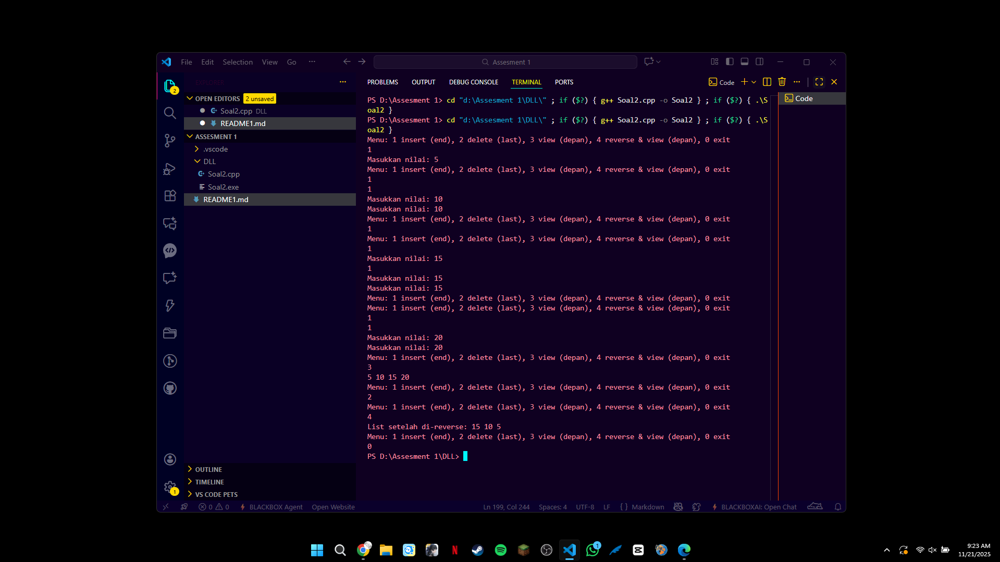

[Tulis Judul Tugas di Sini, misal: Praktikum 1 - Struktur Data]

Identitas Pengumpul

Nama: Ariel Ahnaf Kusuma

NIM: 103112400050

Kelas: IF-12-05

1. Kode Program

Berikut adalah kode program untuk implementasi Doubly Linked List yang menerima input dari user melalui terminal dan menyediakan menu interaktif untuk operasi insert di akhir, delete terakhir, view dari depan ke belakang, serta reverse (tanpa membuat node baru) dan menampilkan hasilnya.

```File: Soal2.cpp
/* Author: Ariel Ahnaf Kusuma
 * NIM: 103112400050
 * Deskripsi: Implementasi DLL dengan
 * 1 insert (end), 2 delete (last), 3 view (depan), 4 reverse & view (depan), 0 exit.
 */

#include <iostream>
#include <string>

using namespace std;

struct Node {
    int data;
    Node* prev;
    Node* next;
    Node(int v): data(v), prev(nullptr), next(nullptr) {}
};

class DoublyLinkedList {
    Node* head;
public:
    DoublyLinkedList(): head(nullptr) {}
    ~DoublyLinkedList(){
        Node* cur = head;
        while(cur){
            Node* nxt = cur->next;
            delete cur;
            cur = nxt;
        }
    }

    void insertEnd(int val){
        Node* node = new Node(val);
        if(!head){
            head = node;
            return;
        }
        Node* cur = head;
        while(cur->next) cur = cur->next;
        cur->next = node;
        node->prev = cur;
    }

    void deleteLast(){
        if(!head) return;
        if(!head->next){
            delete head;
            head = nullptr;
            return;
        }
        Node* cur = head;
        while(cur->next) cur = cur->next;
        cur->prev->next = nullptr;
        delete cur;
    }

    void viewFront(){
        if(!head){
            cout << endl;
            return;
        }
        Node* cur = head;
        bool first = true;
        while(cur){
            if(!first) cout << " ";
            cout << cur->data;
            first = false;
            cur = cur->next;
        }
        cout << endl;
    }

    void reverseInPlace(){
        if(!head) return;
        Node* cur = head;
        Node* temp = nullptr;
        while(cur){
            temp = cur->prev;
            cur->prev = cur->next;
            cur->next = temp;
            cur = cur->prev;
        }
        if(temp) head = temp->prev;
    }
};

int main(){
    DoublyLinkedList dll;
    int choice;
    do{
        cout << "Menu: 1 insert (end), 2 delete (last), 3 view (depan), 4 reverse & view (depan), 0 exit" << endl;
        cin >> choice;
        switch(choice){
            case 1: {
                cout << "Masukkan nilai: ";
                int v; cin >> v;
                dll.insertEnd(v);
                break;
            }
            case 2:
                dll.deleteLast();
                break;
            case 3:
                dll.viewFront();
                break;
            case 4:
                dll.reverseInPlace();
                cout << "List setelah di-reverse: ";
                dll.viewFront();
                break;
            case 0:
                break;
            default:
                break;
        }
    } while(choice != 0);

    return 0;
}
```

2. Penjelasan Kode

Header iostream dan menggunakan namespace std agar operasi input/output (cout, cin, endl) dapat dipanggil tanpa satu satu. 

Struktur Node merepresentasikan satu elemen pada doubly linked list sama tiga anggota: data (int), prev (pointer ke node sebelumnya) dan next (pointer ke node berikutnya). 

Konstruktor Node menjalankan data sesuai argumen dan prev/next ke nullptr.

Kelas DoublyLinkedList nyimpan pointer head ke node pertama. Konstruktor kelas mengatur head ke nullptr; 

destruktor menelusuri list dari head ke tail dan menghapus semua node. 

Metode insertEnd membuat node baru dan menambahkannya di posisi akhir: jika list kosong head menunjuk node baru, jika ngga maka program melakukan traversal sampai node terakhir lalu menghubungkan node baru sebagai next dan mengatur prev node baru. 

Metode deleteLast menghapus node terakhir dengan tiga kasus: jika list kosong fungsi bakal langsung return, jika hanya satu elemen delete head dan set head = nullptr, jika lebih dari satu traversal ke node terakhir lalu putuskan hubungan dengan prev dan delete node terakhir. 

Metode viewFront mencetak isi list dari head ke tail, memisahkan nilai pakai spasi; jika list kosong hanya mencetak baris baru. Metode reverseInPlace bakal membalik urutan list tanpa membuat node baru dengan cara menukar prev dan next pada setiap node saat menelusuri list, lalu memperbarui head ke node terakhir asli.

3. Output Program

Program berjalan dengan menu yg diatur pengguna. urutan operasi sesuai soal: pilih 1 masukkan 5, ulangi pilih 1 masukkan 10, pilih 1 masukkan 15, pilih 1 masukkan 20, pilih 3 untuk view, pilih 2 untuk delete last, pilih 3 untuk view, pilih 4 untuk reverse & view, lalu 0 untuk exit. Output terminal untuk contoh tersebut adalah:

Menu: 1 insert (end), 2 delete (last), 3 view (depan), 4 reverse & view (depan), 0 exit  
1  
Masukkan nilai: 5  
Menu: 1 insert (end), 2 delete (last), 3 view (depan), 4 reverse & view (depan), 0 exit  
1  
Masukkan nilai: 10  
Menu: 1 insert (end), 2 delete (last), 3 view (depan), 4 reverse & view (depan), 0 exit  
1  
Masukkan nilai: 15  
Menu: 1 insert (end), 2 delete (last), 3 view (depan), 4 reverse & view (depan), 0 exit  
1  
Masukkan nilai: 20  
Menu: 1 insert (end), 2 delete (last), 3 view (depan), 4 reverse & view (depan), 0 exit  
3  
5 10 15 20  
Menu: 1 insert (end), 2 delete (last), 3 view (depan), 4 reverse & view (depan), 0 exit  
2  
Menu: 1 insert (end), 2 delete (last), 3 view (depan), 4 reverse & view (depan), 0 exit  
3  
5 10 15  
Menu: 1 insert (end), 2 delete (last), 3 view (depan), 4 reverse & view (depan), 0 exit  
4  
List setelah di-reverse: 15 10 5  
Menu: 1 insert (end), 2 delete (last), 3 view (depan), 4 reverse & view (depan), 0 exit  
0



4. Penjelasan Lanjutan (Analisis Output)

Analisis mengapa output tersebut benar disusun berdasarkan efek setiap operasi terhadap struktur list. Saat insert 5, 
list awalnya kosong sehingga node 5 menjadi head;  view mencetak "5". 

Insert 10 menambah node di akhir sehingga hubungan next/prev antar node diperbarui dan view mencetak "5 10". 

Insert 15 dan 20 memperpanjang tail sehingga view setelah empat insert menampilkan "5 10 15 20". Saat memilih delete last fungsi menelusuri ke node terakhir (20) dan menghapusnya, menyetel next dari node sebelumnya menjadi nullptr sehingga list menjadi "5 10 15"; view berikutnya mencetak urutan itu. 

Saat memilih reverse & view, reverseInPlace menukar prev dan next pada tiap node tanpa membuat node baru lalu meng-update head ke node terakhir asli, sehingga traversal dari head sekarang menghasilkan urutan terbalik; untuk "5 10 15" hasilnya "15 10 5". 
Label "List setelah di-reverse: " dicetak sebelum pemanggilan viewFront sehingga output persis seperti contoh tugas.

5. Kesimpulan

Program ini meng-run operasi insert di akhir, delete terakhir, view depan-ke-belakang, reverse in-place tanpa node baru, serta menu loop untuk input terminal sesuai yg diminta oleh soal. Program aman terhadap kasus list kosong dan satu elemen.